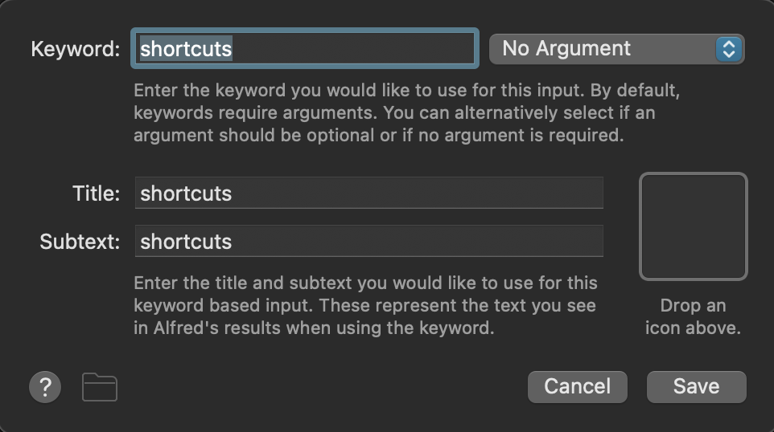
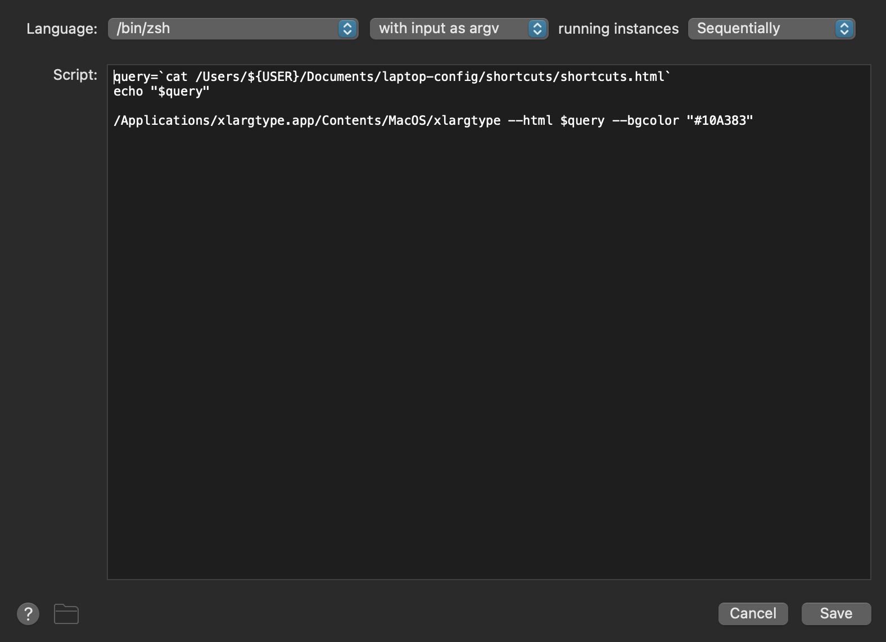

# Alfred-xlargetype

* Example usage xlargetype:







```
query=`cat /Users/${USER}/Documents/laptop-config/shortcuts/shortcuts.html`
echo "$query"

/Applications/xlargtype.app/Contents/MacOS/xlargtype --html $query --bgcolor "#10A383"

#or

/Applications/xlargtype.app/Contents/MacOS/xlargtype --file /Users/${USER}/Documents/laptop-config/shortcuts/shortcuts.html --bgcolor "#10A383"

```


```
/Applications/xlargtype.app/Contents/MacOS/xlargtype --help

Options:
  --help     Show help                                                 [boolean]
  --version  Show version number                                       [boolean]
  --file     Specify a file path                                        [string]
  --html     Specify HTML content                                       [string]
  --bgcolor  Specify background color                                   [string]
  --color    Specify text color                                         [string]
  --thcolor  Specify th background color                                [string]
  --size     Specify window size                        [number] [default: 0.85]
```